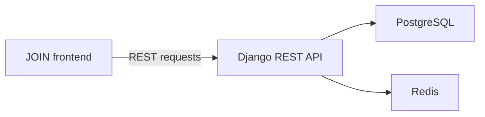

# JOIN 360 — Frontend

**Responsive Kanban task manager built with HTML, CSS and modular JavaScript.**

[](https://developer.mozilla.org/docs/Web/HTML)
[](https://developer.mozilla.org/docs/Web/CSS)
[](https://developer.mozilla.org/docs/Web/JavaScript)
[](https://github.com/AhmetB-Dev/join-backend)

[**Live Demo**](https://ahmet-balci.de/projects/join/) · [**Backend Repository**](https://github.com/AhmetB-Dev/join-backend)

JOIN 360 helps users organize tasks on a Kanban board, manage contacts and track progress across different workflow stages.

## Project context and my contribution

The original frontend was created collaboratively as a team project. After that project phase, I independently developed a Django REST backend and integrated it with the frontend.

This repository therefore demonstrates both:

- collaborative frontend development with HTML, CSS and JavaScript;
- the later integration of a persistent, authenticated REST API.

The backend architecture, authentication, database logic, tests and deployment are documented in the [separate backend repository](https://github.com/AhmetB-Dev/join-backend).

## Core features

- Registration and login
- Isolated guest access
- Kanban board with four workflow columns
- Create, edit and delete tasks
- Assign tasks to contacts
- Add and track subtasks
- Set categories, priorities and due dates
- Drag tasks between columns
- Touch-friendly drag and drop on mobile devices
- Create, edit and delete contacts
- Dashboard summary with task statistics
- Responsive desktop and mobile layouts

## Technical highlights

- Modular JavaScript files organized by data, API, validation and UI responsibilities
- Central API client with a configurable backend URL
- Persistent user-scoped data through the Django REST API
- Desktop and touch drag-and-drop handling
- Reusable task and contact rendering logic
- Client-side form validation and interaction feedback

## Tech stack

| Area | Technology |
| --- | --- |
| Structure | HTML5 |
| Styling | CSS3 |
| Application logic | JavaScript |
| Data exchange | REST API |
| Backend | Django REST Framework |
| Persistence | PostgreSQL through the backend |

## Frontend and backend



The frontend sends authenticated requests for users, contacts and tasks. The backend applies validation and user isolation before persisting data.

## Run locally

```bash
git clone https://github.com/AhmetB-Dev/Join.git
cd Join
```

1. Start the backend using the instructions in [`join-backend`](https://github.com/AhmetB-Dev/join-backend).
2. Serve this frontend with a local HTTP server, such as VS Code Live Server.
3. Open the application in your browser.

The default API URL is:

```text
http://127.0.0.1:8000/api
```

To use a different backend, set the URL before the API client loads:

```html
<script>
  window.JOIN_API_BASE_URL = "https://your-api.example.com/api";
</script>
```

## Related backend capabilities

The independently developed backend adds:

- token-based authentication
- user-scoped contacts and tasks
- isolated guest workspaces
- PostgreSQL persistence
- Redis caching and throttling
- automated tests
- Docker-based deployment
- CI/CD with rollback support

---

Built as part of my Fullstack Developer portfolio.
